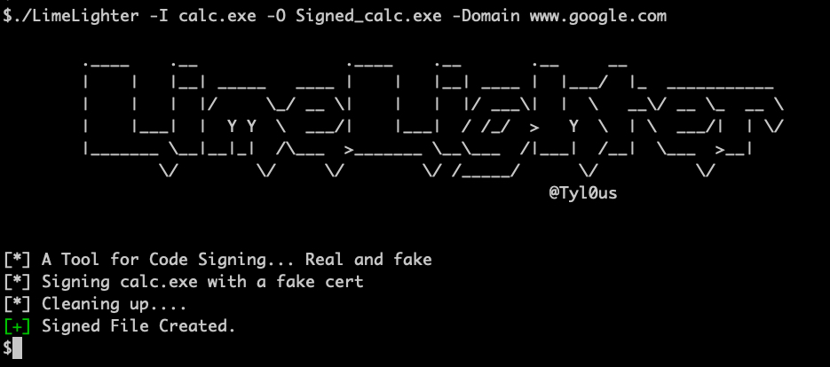
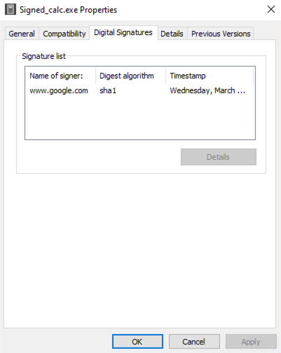

# LimeLighter

A tool which creates a spoof code signing certificates and sign binaries and DLL files to help evade EDR products and avoid MSS and sock scruitney. LimeLighter can also use valid code signing certificates to sign files. Limelighter can use a fully qualified domain name such as `acme.com`.


## Contributing
LimeLighter was developed in golang.

Make sure that the following are installed on your OS 

```
openssl
osslsigncode
```

The first step as always is to clone the repo. Before you compile LimeLighter you'll need to install the dependencies. To install them, run following commands:
```
go get github.com/fatih/color
```

Then build it

```
go build LimeLighter.go
```


## Usage

```
./LimeLighter -h       

        .____    .__               .____    .__       .__     __                
        |    |   |__| _____   ____ |    |   |__| ____ |  |___/  |_  ___________ 
        |    |   |  |/     \_/ __ \|    |   |  |/ ___\|  |  \   __\/ __ \_  __ \
        |    |___|  |  Y Y  \  ___/|    |___|  / /_/  >   Y  \  | \  ___/|  | \/
        |_______ \__|__|_|  /\___  >_______ \__\___  /|___|  /__|  \___  >__|   
                \/        \/     \/        \/ /_____/      \/          \/         
                                                        @Tyl0us


[*] A Tool for Code Signing... Real and fake
Usage of ./LimeLighter:
  -Domain string
        Domain you want to create a fake code sign for
  -I string
        Unsiged file name to be signed
  -O string
        Signed file name
  -Password string
        Password for real  certificate
  -Real string
        Path to a valid .pfx certificate file
  -Verify string
        Verifies a file's code sign certificate
  -debug
        Print debug statements

```

To sign a file you can use the command option `Domain` to generate a fake code signing certificate.



to sign a file with a valid code signing certificate use the `Real` and `Password` to sign a file with a valid code signing certificate.


To verify a signed file use the `verify` command.



